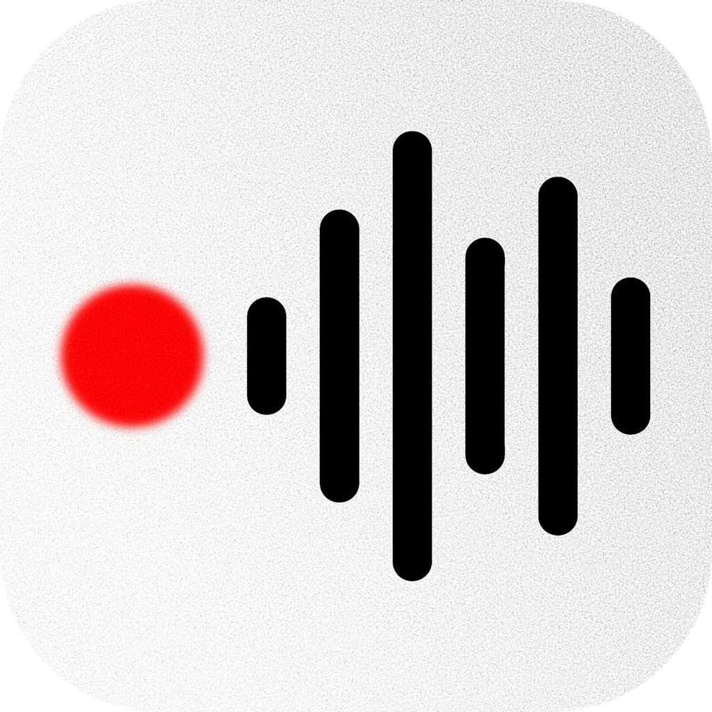

<p align="center">
  
</p>

<h1 align="center">QuickTalk</h1>

<p align="center"><strong>Hold a key, speak, let go — the text appears where your cursor is.</strong></p>

<p align="center">
  
  
  
</p>

A push-to-talk dictation app for macOS. Menu bar only, no Dock icon, powered by Google's
**Gemini 3.5 Transcribe** with your own API key. English and German are detected
automatically; there is no language setting to switch.

No dependencies, no telemetry, no accounts. One network destination, and it's Google's.

---

## Install

There is no download — you build it yourself, in one command
([why](#why-theres-no-prebuilt-download)):

```bash
./build.sh
```

That compiles, assembles the `.app`, signs it, and installs it to `/Applications`. Needs
macOS 14+ and the Swift toolchain (`xcode-select --install` is enough). Then:

```bash
open /Applications/QuickTalk.app
```

Settings opens on first run. Work top to bottom:

1. **Paste your Gemini API key** — free from [aistudio.google.com](https://aistudio.google.com).
2. **Grant Input Monitoring**, then **quit and reopen.** The restart is not optional.
3. **Grant Accessibility** — takes effect immediately.
4. **Grant Microphone** — you'll be asked on your first dictation.

The menu-bar item is the source of truth. When it reads **"Hold Right ⌘ to dictate"**,
everything is live; otherwise it names the missing permission.

## Using it

Hold **Right ⌘**, speak, release. A pill appears at the bottom of the screen with a level
meter, switches to "Transcribing…", and the text is pasted at your cursor. Presses shorter
than 0.25 s are ignored.

| Setting | Default | Notes |
|---|---|---|
| Push-to-talk key | Right ⌘ | Also Left ⌘, Right/Left ⌥, Right ⌃, fn |
| Microphone | System Default | Any connected input, remembered per device |
| Mode | Smart | See below |
| Start cue | Purr | Six system sounds, previewed as you pick |
| App instructions | none | Per-app notes, added in Smart mode |

### Modes

| Mode | How | Formatting | Per ~6 s dictation |
|---|---|---|---|
| **Verbatim** | streamed while you speak | word for word | ~$0.0009 |
| **Smart** | streamed, then tidied | paragraphs and real lists | ~$0.0013 |
| **Cheap** | one request after you finish | word for word | ~$0.0005 |

At 100 dictations a day that's roughly **$2.60 / $3.80 / $1.50 a month**.

Verbatim and Smart stream audio over a WebSocket *while you speak*, so the transcript is
ready when you release the key. The audio file is written to disk even during a live
session, so if the socket fails the batch request runs instead — a failed socket costs
latency, never words.

Switch modes from the menu-bar icon under **Formatting**, without opening Settings.

### Per-app instructions

Dictating into a chat app and into an editor want different output from the same voice.
QuickTalk sees which app was frontmost when you pressed the key and adds that app's
standing instructions to the Smart formatting pass.

Open **App Instructions…** from the menu bar, add an app, and write what should happen —
"use plenty of emojis and keep it casual" for a chat app, "plain prose, no markdown" for
an editor.

Instructions apply in **Smart mode only**, since the other modes have no formatting pass
to put them in. A result that stopped resembling your dictation is discarded and the raw
transcript pasted instead. Detecting the frontmost app needs **no extra permission** — a
name and bundle ID are public metadata; QuickTalk never reads window titles or contents.

## Permissions

| Permission | For | Restart needed? |
|---|---|---|
| **Input Monitoring** | Seeing the key while you're in *another* app | **Yes** |
| **Accessibility** | Pasting the result | No |
| **Microphone** | Recording | No |

Two traps worth knowing. **Input Monitoring is not Accessibility** — without it,
`CGEvent.tapCreate` still succeeds and delivers only this app's own events, so the hotkey
works in QuickTalk and nowhere else, with no error to catch. And **macOS keys permissions
on path *and* code signature**, so two copies of the app are two identities in the Privacy
list, both called "QuickTalk".

To reset (note that Input Monitoring is `ListenEvent`):

```bash
killall QuickTalk; tccutil reset Microphone com.quicktalk.QuickTalk; tccutil reset Accessibility com.quicktalk.QuickTalk; tccutil reset ListenEvent com.quicktalk.QuickTalk
```

## Troubleshooting

**Hotkey does nothing outside QuickTalk** → Input Monitoring. Grant it, quit, reopen.

**Permission looks enabled but the app disagrees** → a stale entry for an older copy or
signature. Reset with the command above, remove duplicate QuickTalk rows, re-grant.

**"No speech" when you did speak** → check the microphone picker. **Copy Diagnostics**
shows `peakLevel` per take: real speech reads 0.019+, silence 0.000–0.002. A peak near
zero means capture failed, not the API.

**Bluetooth headphones go muffled while dictating** → pick the built-in microphone rather
than "System Default". A Bluetooth headset can't carry high-quality playback and a mic at
once; opening its mic switches it from A2DP to HFP. That's the headset's limitation.
QuickTalk opens exactly the device you pick, so the built-in mic leaves your music alone.

## Your API key

Stored in a file only your macOS account can read:

```
~/Library/Application Support/QuickTalk/gemini-api-key    mode 0600, in a 0700 directory
```

Not in preferences — `defaults read` prints those in full, which leaks the moment someone
pastes their settings into a bug report. Not in the Keychain either: macOS grants keychain
access per code signature, so self-built copies (usually ad-hoc signed, whose signature
changes every build) get a password overlay every time.

It's excluded from Time Machine, never logged, and the diagnostics log redacts anything
key-shaped — so **Copy Diagnostics** output is safe to paste publicly. Settings has a
**Remove** button.

**What this doesn't do:** protect the key from other software running as *you*. No local
store does — anything that can decrypt a key is readable by whatever decrypts it, and the
Keychain only raises the bar. If your machine stops being trustworthy, revoke the key at
[aistudio.google.com](https://aistudio.google.com).

## Privacy

- **The key tap watches `flagsChanged` only** — modifier keys. No keystrokes, and
  therefore no passwords, pass through this process. It's `.listenOnly`, so your
  push-to-talk key keeps working normally.
- **The microphone is open only while you hold the key** — no idle audio session.
- **Audio is deleted after upload**, including when transcription fails.
- **Your clipboard is restored** after the paste.
- **One network destination**, `generativelanguage.googleapis.com`.

## Contributing

```bash
./build.sh          # compile, assemble, sign, install
swift build         # compile only (produces no runnable app)
```

Deliberately **no Xcode project** and **no third-party dependencies** — please keep it
that way. `CLAUDE.md` documents the platform traps behind the odd-looking code, including
the Gemini API's two silent failure modes. Read it before "simplifying" anything; most of
it is load-bearing.

The icon is `AppIcon.png` — full-bleed 1024×1024 artwork with its own rounded corners.
Regenerate the bundled `.icns` after changing it:

```bash
swift make-icon.swift && iconutil -c icns AppIcon.iconset -o AppIcon.icns
```

`build.sh` signs with your **Apple Development** certificate if you have one, and ad-hoc
otherwise. Both work, but a certificate gives a stable signature, so macOS permissions are
granted once instead of re-granted every build.

There are no automated tests. Check by hand: build, confirm the menu bar reads "Hold
Right ⌘ to dictate", then **switch to another app** and dictate — that last step is what
catches a missing Input Monitoring grant.

### Why there's no prebuilt download

Gatekeeper blocks un-notarised downloads, and notarisation needs the paid Apple Developer
Program plus a Developer ID certificate. A development-signed build won't run on other
Macs at all, and any signature names its signer. Besides, an app that can type into every
window deserves to be read before it's run.

Forking to ship releases? You'll need a Developer ID certificate, `xcrun notarytool`, and
your own bundle identifier — change `CFBundleIdentifier` in `Info.plist` and the matching
`--identifier` in `build.sh`.

## License

MIT — see [LICENSE](LICENSE).
